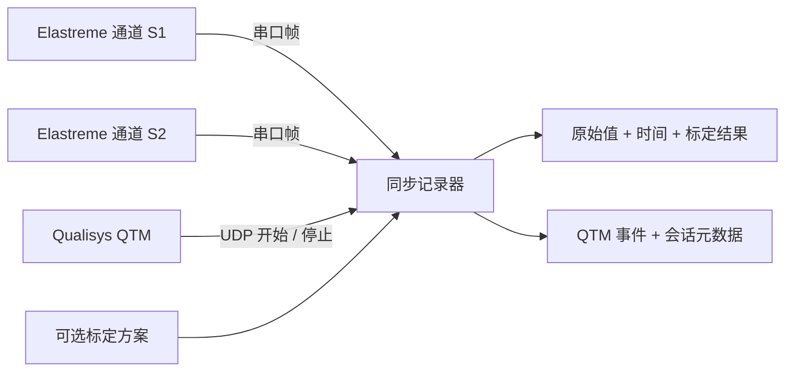

<div align="center">

# Qualisys × Elastreme Synchronization

### QTM 开始采集，双通道传感器自动记录

面向 Elastreme 柔性传感器的 Windows 同步采集工具，支持原始数据保存与实验性踝关节标定。

中文｜[GitHub](https://github.com/anonymousguestme-ctrl/ElastreameFlexSensorQualisysSynchronization)｜[离线操作指南](操作指南.html)

</div>

---

## ✨ 为什么做它

同时手动点击 QTM 和传感器软件，会给每次实验引入不同的启动时间差。这个项目让同步软件先接收传感器数据，再用 QTM 的 `CaptureStart` 和 `CaptureStop` 广播控制记录。

每次测量自动生成一组原始 CSV、QTM 事件和会话信息。两路串口分别保留接收时间，便于后续与 QTM/C3D 数据对齐。

| 能力 | 当前行为 |
| --- | --- |
| 双通道采集 | S1、S2 使用两个独立 COM 口 |
| 自动启停 | 接收 QTM UDP 开始/停止广播 |
| 预触发缓存 | 默认保存开始前约 1 秒数据 |
| 原始数据 | 保留原始值、帧文本、有效标记和主机时间 |
| 标定原型 | 基准归零、多点分段线性插值、稳定性检查 |
| 时间对齐 | 每帧记录相对 QTM 开始消息的时间 |

> [!IMPORTANT]
> 这是基于电脑接收时间的软件同步。成功收到起止事件并不证明硬件时钟同步或固定毫秒级精度。

## 🧭 它是怎么工作的



程序持续接收分号结尾的帧，例如 `0653;`。收到 QTM 开始消息后，它建立测量目录、写入预触发缓存并持续记录；收到停止消息后关闭文件。

## 📦 需要准备什么

| 项目 | 要求 |
| --- | --- |
| 操作系统 | Windows |
| QTM | 可以正常采集，已设置 Capture Broadcast Port |
| 传感器 | 两个 Elastreme 单通道采集盒及对应 USB 接收器 |
| 串口 | 两个不同 COM 口，`115200, 8N1` |
| Python | 源码运行需要 Python 3.10 或更高版本及 `py` 启动器 |
| Python 依赖 | `pyserial`，由安装脚本安装 |

接收器外壳编号 `0051/0053` 不会由 CH340 自动报告给 Windows。COM 号会变化，必须按实际设备核对；当前默认 `COM3/COM4` 只适用于已测试的电脑，编号仍为 `unverified`。

## ⚡ 快速开始

### 1. 下载项目

```powershell
git clone https://github.com/anonymousguestme-ctrl/ElastreameFlexSensorQualisysSynchronization.git
cd ElastreameFlexSensorQualisysSynchronization
```

### 2. 安装并启动

在项目目录打开 PowerShell：

```powershell
.\install.ps1
.\启动同步采集.bat
```

安装脚本创建 `.venv-local` 并安装串口依赖。安装后可直接双击 `启动同步采集.bat`。

> [!NOTE]
> 如果 PowerShell 阻止脚本执行，可以手动运行以下命令：
>
> ```powershell
> py -3 -m venv .venv-local
> .\.venv-local\Scripts\python.exe -m pip install -r requirements.txt
> .\启动同步采集.bat
> ```

### 3. 连接设备

1. 将两个 USB 接收器插入运行 QTM 的电脑。
2. 打开采集盒，确认传感器连接与无线配对。
3. 关闭其他占用串口的 Elastreme 软件。
4. 在同步界面选择 S1、S2 的实际 COM 口。

### 4. 配置 QTM

在 `Project Options > Real-Time output` 中确认 `Capture Broadcast Port`，默认使用 `8989`。同步软件中的端口必须与它一致。

### 5. 做一次短采集

点击同步软件的“进入待机”，确认两个通道有数据后，在 QTM 开始并停止一次约 5 秒采集。

```text
设备上电 → 进入待机 → 2 / 2 有数据 → QTM 开始 → QTM 停止 → 检查输出
```

## 🚦 如何判断状态

| 界面或记录状态 | 含义 | 下一步 |
| --- | --- | --- |
| `2 / 2 已打开` | 两个串口打开成功 | 等待实际数据到达 |
| `2 / 2 有数据` | 两路都收到过帧 | 检查 QTM 监听状态 |
| `等待 QTM` | UDP 监听已启动 | 在 QTM 开始短采集 |
| `正在记录` | 已收到开始消息 | 正常完成 QTM 采集 |
| `已保存 · 待机` | 已收到停止消息并关闭记录 | 检查 CSV 和事件文件 |
| `RESULT=SUCCESS` | QTM 停止消息报告成功 | 继续核对两路数据完整性 |

`2 / 2 有数据` 表示曾收到首帧，当前版本尚未持续检测后续断流。正式使用前仍应检查文件中的时间连续性。

## 🦶 踝关节标定：当前原型

标定与采集共用串口数据。先进入待机，然后分别选择 S1 或 S2 操作。

### 基准归零

把踝关节放在规定中立位并保持静止，点击“3 秒基准归零”。软件对已有缓存按**数值排序**，去掉最高和最低各 10% 的值，计算中位数、均值和标准差，使用中位数作为 `x0`。

```text
Δx = 原始值 − x0
```

> [!WARNING]
> 按钮目前读取已有缓存，不会启动一次新的 3 秒倒计时。缓存长度由 `pretrigger_seconds` 决定，默认约 1 秒，因此实际窗口可能短于按钮上的 3 秒。当前记录的时长字段是请求窗口，尚未验证完整覆盖时长。

标准差阈值默认是 **20 个原始数值单位**，不是角度单位，尚未经过实验确定。重新佩戴、改变位置或灵敏度后，需要重新归零并重新核对角度标定。

### 多点角度标定

在每个已知姿态保持静止，输入实际角度，选择方向，再点击“采集当前标定点（3 秒）”。推荐准备 3 到 5 个点，例如：

| 示例姿态 | 示例角度 | 方向标签 |
| --- | ---: | --- |
| 中立位 | 0° | `unknown` |
| 背屈 | +10°、+20° | `dorsiflexion` |
| 跖屈 | −10°、−20° | `plantarflexion` |

正负号是本表的示例约定，实验中应统一并记录。当前算法至少有两个点即可插值；超出标定范围会返回边界角度。

标定方案存为 `calibration_profile.json`。当前可计算基准差、分段线性角度以及标定点上的残差指标。

> [!IMPORTANT]
> 分段插值在参与拟合的点上通常误差为零，R²、RMSE 不能证明实际角度准确。请用未参与拟合的姿态独立验证。运行时尚未自动判断加载/卸载方向，当前角度计算会使用全部标定点。

## 🧾 输出文件与数据字段

```text
records/
└─ MeasurementName_YYYYMMDD_HHMMSS_mmm/
   ├─ elastreme_raw.csv   每帧原始值、时间和可用的标定结果
   ├─ qtm_events.jsonl    QTM 开始/停止 XML 与接收时间
   └─ session.json        测量名、通道配置、帧数和到帧率

calibration_profile.json 当前标定方案，首次保存标定后生成
```

保存目录以界面的“保存位置”为准。每个串口独立写入长表，两个通道不会被强行拼成同一行。

| CSV 字段 | 含义 |
| --- | --- |
| `channel` / `sample_index` | 通道与待机期间累计编号 |
| `host_monotonic_ns` / `host_datetime_iso` | 主机单调时钟与日期时间 |
| `relative_to_qtm_start_ms` | 相对开始消息的时间，预触发值通常为负 |
| `raw_value` / `raw_frame` | 数值与分号拆帧后的原始文本 |
| `frame_valid` / `pretrigger` | 数值格式有效标记与预触发标记 |
| `baseline_delta` | 相对中立位基准的差值 |
| `calibrated_angle_deg` | 当前方案计算的角度；未具备条件时为空 |
| `calibration_status` | `calibrated`、`baseline_only`、`baseline_missing`、`unavailable` |

会话保存标定方案编号和版本；当前尚未把完整方案快照复制进每次会话。归档实验时，请一起保存当时使用的 `calibration_profile.json`。

## 🧪 无硬件测试

安装依赖后打开两个 PowerShell 窗口。

窗口一，模拟两个传感器：

```powershell
.\.venv-local\Scripts\python.exe .\sync_capture.py --simulate-sensor
```

窗口二，发送模拟 QTM 起止事件：

```powershell
.\.venv-local\Scripts\python.exe .\simulate_qtm.py --duration 3
```

运行项目测试：

```powershell
.\.venv-local\Scripts\python.exe -m unittest -v test_sync_capture
```

## 🛠️ 故障排查

| 现象 | 优先检查 |
| --- | --- |
| 找不到串口 | USB 连接、CH340 驱动、设备管理器和“刷新串口” |
| 串口打开失败 | 是否被其他软件占用，S1/S2 是否重复 |
| 已打开但没有帧 | 采集盒电源、配对与传感器连接 |
| QTM 开始但不记录 | 两边广播端口是否一致、UDP 是否被防火墙拦截 |
| 少一路数据 | COM 口映射与该采集盒的连接状态 |
| 标定提示不稳定 | 保持姿态静止，再查看原始数值波动 |
| 没有角度列数值 | 该通道是否有基准和至少两个标定点 |

## ⏱️ 采样率与同步边界

软件发送单字节设备请求值 `20`、`50` 或 `100`，并保存收到的全部帧。`20` 参数的真实硬件含义和采样周期仍需厂商协议或独立测量确认，不能仅凭界面标签认定每 20 ms 产生一个独立采样点。

2026-10-03 的一次实机测试收到约 **274 帧/秒/通道**，QTM 起止广播间隔约 **9.08 秒**，两路分别保存 2,754 和 2,761 帧（含预触发）。这是主机到帧统计，不证明传感器内部采样率或每帧都是独立新样本。

串口帧目前没有设备采样时间和序号，无法可靠检测或恢复丢帧。软件可以拼接半帧、拆分粘帧并标记非数值帧，但还没有物理数值量程校验。

## 📁 项目结构

```text
sync_capture.py                 QTM 监听、串口读取和文件保存
sync_gui.py                     图形界面及标定入口
calibration.py                  基准统计和分段插值
config.json                     串口、端口和保存配置
install.ps1                     本机环境安装
requirements.txt                运行依赖
启动同步采集.bat                 图形界面启动
simulate_qtm.py                 QTM 事件模拟器
test_sync_capture.py            核心功能测试
Qualisys_Elastreme_Sync.spec     PyInstaller 打包配置
操作指南.html / guide.html       离线指南
```

## 📦 构建便携版

```powershell
.\.venv-local\Scripts\python.exe -m pip install pyinstaller
.\.venv-local\Scripts\python.exe -m PyInstaller --noconfirm Qualisys_Elastreme_Sync.spec
Copy-Item config.json dist\Qualisys_Elastreme_Sync\config.json
```

打包前将便携版配置中的 `output_directory` 设为相对路径 `records`。复制整个 `dist\Qualisys_Elastreme_Sync` 目录，保留 EXE、`_internal` 和 `config.json`。目标电脑无需安装 Python。

仓库上传的是源码；本机生成的 ZIP 和 EXE 未提交。上面的命令可以重新构建便携版。

## ⚠️ 当前限制

- 标定属于原型，尚未做真实踝角独立验证。
- 尚无标定导入/导出界面、曲线图、自动温度补偿或漂移监测。
- 不稳定基准会报错，但内部状态尚未做到完整回滚；报错后应重新采集稳定基准再使用角度结果。
- 当前标定方案可被后续操作修改；实验归档时请保存对应方案文件。
- 到帧率、标定内残差和单次起止测试不能证明角度精度或同步精度。

## 🔐 实验数据

`.gitignore` 排除了采集记录、标定状态、Python 虚拟环境、构建缓存和历史压缩包。实际实验数据保存在使用者电脑上。
